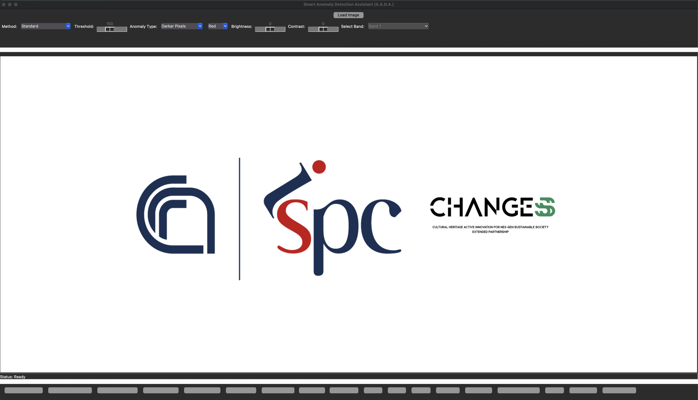

# Smart Anomaly Detection Assistant (SADA) · v1.5

> **SADA** is a free, open‑source desktop application that helps archaeologists analyse aerial/satellite imagery and produce **GIS‑ready anomaly layers**. It consolidates pre‑processing, anomaly detection, spatial statistics, editing, and export into a single, intuitive, **human‑in‑the‑loop** workflow.

- **Project**: CNR–ISPC · PNRR “CHANGES” (Spoke 5)
- **Focus**: accessible remote‑sensing analysis for archaeology (non‑invasive prospection, monitoring, landscape analysis)
- **Status**: v1.5 (beta)
- **Platforms**: Windows · macOS · Linux
- **License**: see `LICENSE` (recommended: GPL‑3.0‑or‑later)

---

## Table of Contents
- [Key Features](#key-features)
- [Architecture](#architecture)
- [Methods](#methods)
- [Installation](#installation)
  - [Option A — pip (minimal)](#option-a--pip-minimal)
  - [Option B — conda/mamba (recommended for GDAL)](#option-b--condamamba-recommended-for-gdal)
- [Quick Start](#quick-start)
- [Typical Workflows](#typical-workflows)
- [Data & I/O](#data--io)
- [Limitations](#limitations)
- [Troubleshooting & FAQ](#troubleshooting--faq)
- [Roadmap](#roadmap)
- [Contributing](#contributing)
- [Citation](#citation)
- [Acknowledgements](#acknowledgements)
- [Contact](#contact)

---

## Key Features
- **All‑in‑one GUI**: no need to juggle multiple GIS/RS tools or notebooks.
- **Pre‑processing**: raster calculator (NDVI, OSAVI, VARI, GEMI, **BNDVI**, TGI + custom formulas), histogram equalisation, brightness/contrast, PCA viewer.
- **Detection families**: spectral anomaly detectors (Standard, **RX**, **Isolation Forest**, **LOF**, **OC‑SVM**), **K‑means/DBSCAN** clustering, **LISA** (Local Moran’s *I*, Getis‑Ord *G*), PCA as enhancement/outlier flagging.
- **Anomaly Editor**: quick clean‑up (Standard threshold, **Z‑score**, **local‑contrast** 1×1/3×3/5×5), manual erase/selection, iterative refine/reset.
- **GIS‑ready export**: georeferenced rasters and shapefiles when input is georeferenced; image export otherwise.
- **Guided UX**: on‑hover tooltips; guardrails expose only compatible options (e.g., hide NIR‑dependent indices if only RGB is present; disable shapefile export without georeferencing).
- **Reproducible**: explicit, step‑by‑step workflow.

> **Note**: SADA is **not** an automatic site detector; it assists analysis while keeping interpretation with the archaeologist.

---

## Architecture
- **Language/stack**: Python 3.10+, Tkinter GUI.
- **Core libs**: NumPy, OpenCV, Pillow, scikit‑learn, libpysal/**esda** (LISA), (optional) GDAL/Rasterio for georasters.
- **Key modules**:
  - `gui.py` — application entry point and interface logic (load → pre‑process → detect → edit → export).
  - `image_processing.py` — algorithms: PCA, RX, Isolation Forest, OC‑SVM, LOF, K‑means, DBSCAN, LISA; overlays and masks.
- **Outputs**: PNG/TIFF/GeoTIFF; ESRI Shapefile (when georeferenced).

---

## Methods
**Spectral anomaly detectors**
- **Standard threshold** — intensity‑based (brightest/darkest).
- **RX detector** — Mahalanobis distance in spectral space (global outlier).
- **Isolation Forest** — ensemble, partitions space to isolate outliers.
- **Local Outlier Factor (LOF)** — density‑based local deviation.
- **One‑class SVM (OC‑SVM)** — novelty detection relative to background.

**Unsupervised clustering**
- **K‑means** — partitions by spectral similarity.
- **DBSCAN** — density‑based clusters with noise handling.

**Spatial autocorrelation**
- **LISA** — Local Moran’s *I*, Getis‑Ord *G*; highlights statistically significant hot/cold spots.

**Dimensionality reduction / enhancement**
- **PCA** — compute/view components; support for RGB composites from PCs.

---

## Installation

> **Prerequisites**: Python **3.10+**; a C/C++ build chain may be needed for some wheels. For geospatial I/O at scale, consider installing **GDAL** (via conda is easiest).

### Option A — pip (minimal)
```bash
# 1) Clone
git clone https://github.com/<your-org>/SADA.git
cd SADA

# 2) Virtual environment
python -m venv .venv
# Windows: .venv\Scripts\activate
# macOS/Linux:
source .venv/bin/activate

# 3) Install Python deps
pip install -r requirements.txt

# (Optional) GeoTIFF/large rasters
# pip install rasterio GDAL   # see platform notes for GDAL
```

### Option B — conda/mamba (recommended for GDAL)
```bash
# 1) Create env
mamba create -n sada python=3.11 gdal rasterio -c conda-forge
mamba activate sada

# 2) Clone & install
git clone https://github.com/<your-org>/SADA.git
cd SADA
pip install -r requirements.txt
```

---

## Quick Start
```bash
python gui.py
```
1. **Load** a raster (GeoTIFF preferred).  
2. **Pre‑process** (indices, histogram, PCA) as needed.  
3. **Detect** anomalies (choose method; preview/iterate).  
4. **Edit** in the Anomaly Editor (filters, manual refinement).  
5. **Export** georeferenced raster/shapefile (if input is georeferenced) or an image for later GIS georeferencing.


## Data & I/O
- **Supported inputs**: GeoTIFF, TIFF, JPG, PNG (multi‑band supported).  
- **Georeferencing**: if present, the canvas displays a **scale bar**, **north arrow**, and **coordinates** automatically; outputs can be **GIS‑ready**.  
- **Logical band names**: map bands to semantic roles (R/G/B/NIR/RE) for index calculators; manually add a band name if it is missing from the presets.  
- **Selections**: rectangular/polygonal AOIs; masks for targeted analysis.  
- **Exports**: PNG/TIFF/GeoTIFF; ESRI Shapefile (requires georeferenced input).


## Roadmap
- **Deep‑learning detectors** (human‑in‑the‑loop).  
- **SAR** derivatives and multi‑modal fusion.  
- **Anomaly Editor** upgrades and light **batch/cloud** tools.  
- Enhanced **provenance logging** (parameters, band maps, random seeds).

---

## Contributing
Contributions are welcome!  
- Open an **issue** for bugs/ideas.  
- Submit **pull requests** against `dev` with a clear description and small, focused commits.  
- Code style: **Black** (line length 88), type hints where reasonable.  
- Please add/update docstrings and **examples** when introducing a new method or UI control.

---

## Citation
If you use SADA in research, please cite the software and this repository:
```
Ciccone, Gabriele, et al. SADA — Smart Anomaly Detection Assistant, v1.5.
GitHub repository, 2025. https://github.com/<your-org>/SADA
```

---

## Acknowledgements
Developed at **CNR–ISPC (Potenza)** within **PNRR “CHANGES” – Spoke 5**.  
Portions of the codebase were **co‑developed with ChatGPT** for rapid prototyping and UX refinement.

---

## Contact
**Testing or contributing?** Write to **gabriele.ciccone@cnr.it**.  
Public GitHub repository coming soon.

